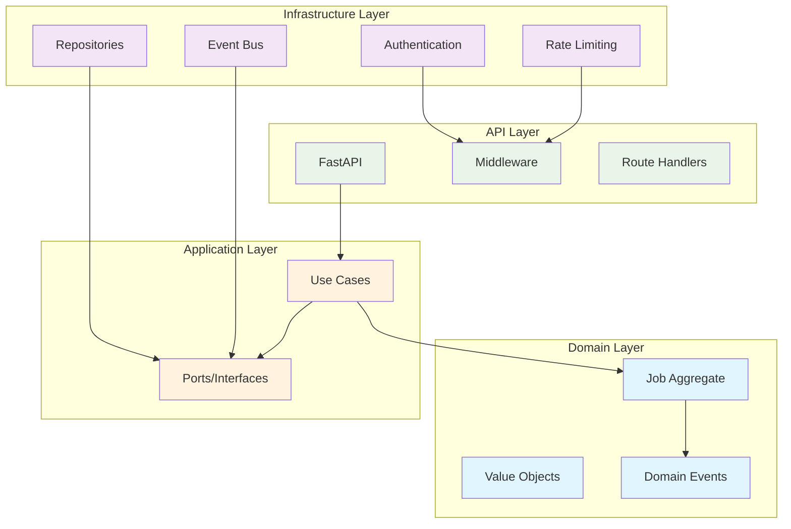

# ValidaHub 🚀

> **The Bloomberg of Brazilian Marketplaces**  
> Transform CSV validation into marketplace intelligence that drives better decisions and higher sales.

[](https://opensource.org/licenses/MIT)
[](docs/security/)
[](docs/architecture/)
[](https://www.python.org/downloads/)

---

## 🎯 Vision & Mission

**Mission**: Transform catalog errors into marketplace intelligence, helping sellers sell more and integrators operate with confidence.

**Vision**: Become Brazil's standard business intelligence for e-commerce in 3 years — the definitive platform where sellers, integrators, and marketplaces find competitive insights and predictions.

### Why ValidaHub Exists

- **Today**: Each seller suffers alone with different rules, repetitive errors, and lost sales
- **Tomorrow**: A central hub of validation + intelligence that auto-corrects, generates insights, and improves everyone's performance

---

## 🧠 Architecture-First Development

ValidaHub is built with a **Domain-Driven Design** architecture that separates business logic from infrastructure, enabling rapid feature development and easy testing.



---

## 💡 Current Features (MVP)

### 🔥 Core Validation Engine
- **Multi-tenant architecture**: Complete tenant isolation with security
- **Job processing pipeline**: Submit, track, and retry CSV validation jobs
- **Real-time updates**: Server-sent events for live job status
- **Idempotency protection**: Safe retry mechanisms with duplicate prevention
- **Audit logging**: Complete LGPD-compliant audit trail

### 🛡️ Security & Compliance
- **JWT authentication**: Secure token-based auth with scopes
- **Rate limiting**: Per-tenant quotas via Redis
- **CSV security**: Formula injection prevention
- **LGPD compliance**: Data protection and privacy rights
- **Multi-tenant isolation**: Complete data separation

### 🏗️ Developer Experience
- **Clean Architecture**: DDD with ports & adapters
- **Contract testing**: Architecture validation in CI
- **Structured logging**: OpenTelemetry-compatible tracing
- **Docker development**: One-command environment setup

---

## 🏛️ Technology Stack

### Backend (Implemented)
- **API**: FastAPI with Pydantic validation
- **Architecture**: Domain-Driven Design + Clean Architecture
- **Database**: PostgreSQL 15 with JSONB support
- **Cache/Queue**: Redis for rate limiting and event streaming
- **Authentication**: JWT with RS256 signing
- **Logging**: Structured logging with correlation IDs
- **Testing**: pytest with architecture validation

### Infrastructure
- **Development**: Docker Compose
- **Observability**: OpenTelemetry traces and metrics
- **Security**: CORS, security headers, trusted hosts
- **Multi-tenancy**: Row-level security and tenant isolation

---

## 🚀 Quick Start

### Prerequisites
- Docker & Docker Compose
- Python 3.11+ 
- Git

### 5-Minute Setup

```bash
# Clone the repository
git clone https://github.com/validahub/validahub-alpha.git
cd validahub-alpha

# Install Python dependencies
pip install -r requirements-dev.txt

# Start infrastructure services (PostgreSQL, Redis, etc.)
make up

# Run database migrations (when Alembic is configured)
# make db.migrate

# Start development API server
make dev

# Your ValidaHub API is ready!
# API: http://localhost:8000
# API Documentation: http://localhost:8000/docs
```

### First Job Submission

```python
import requests
import uuid

# Submit a CSV validation job
response = requests.post('http://localhost:8000/v1/jobs', 
    headers={
        'Authorization': 'Bearer your-jwt-token',
        'X-Tenant-Id': 't_demo_tenant',
        'Idempotency-Key': str(uuid.uuid4()),
        'Content-Type': 'application/json'
    },
    json={
        'channel': 'mercado_livre',
        'type': 'validation',
        'seller_id': 'seller_123',
        'file_ref': 's3://uploads/tenant123/products.csv',
        'rules_profile_id': 'ml@1.0.0'
    }
)

job = response.json()
print(f"Job created: {job['job_id']}")

# Monitor progress via Server-Sent Events
import sseclient

events = sseclient.SSEClient(
    'http://localhost:8000/v1/jobs/stream',
    headers={
        'Authorization': 'Bearer your-jwt-token',
        'X-Tenant-Id': 't_demo_tenant'
    }
)

for event in events:
    print(f"Status update: {event.data}")
```

---

## 📡 API Reference

### Core Endpoints (Implemented)

```yaml
# Job Management
POST   /v1/jobs           # Submit validation job (requires Idempotency-Key)
GET    /v1/jobs/{id}      # Get job details and status  
POST   /v1/jobs/{id}/retry # Retry failed job
GET    /v1/jobs           # List jobs with filtering
GET    /v1/jobs/stream    # Real-time updates via Server-Sent Events

# System Health
GET    /health            # Health check
GET    /ready             # Readiness check with dependency status
```

### Required Headers

```http
Authorization: Bearer <jwt-token>     # Required for all endpoints except health
X-Tenant-Id: t_your_tenant           # Required for all job operations  
Idempotency-Key: <unique-key>         # Required for POST /v1/jobs
```

### Event-Driven Architecture

Every job operation generates events for audit and future intelligence:

```json
{
  "id": "550e8400-e29b-41d4-a716-446655440000",
  "specversion": "1.0",
  "source": "apps/api",
  "type": "job.submitted",
  "time": "2025-08-29T15:30:00Z",
  "subject": "job:6c0e7b5a-4f3c-4d1e-9b8f-2a1c3d4e5f6g",
  "tenant_id": "t_demo_tenant",
  "request_id": "req_123",
  "trace_id": "trace_456",
  "data": {
    "job_id": "6c0e7b5a-4f3c-4d1e-9b8f-2a1c3d4e5f6g",
    "seller_id": "seller_123",
    "channel": "mercado_livre",
    "type": "validation"
  }
}
```

---

## 🏗️ Development

### Development Commands

```bash
# Infrastructure
make up                 # Start PostgreSQL, Redis, MinIO, OpenTelemetry
make down              # Stop all services
make logs              # Show Docker logs

# Testing
make test              # Run all tests with coverage
make test.unit         # Unit tests only
make test.integration  # Integration tests only
make test.architecture # Validate layer dependencies

# Code Quality  
make lint              # Ruff linting
make format            # Black + Ruff formatting
make check.arch        # Validate architecture rules

# Development
make dev               # Start API server
make install           # Install dependencies
make clean             # Clean temporary files
```

### Architecture Principles

- **Domain Purity**: Domain layer has zero framework dependencies
- **Dependency Inversion**: Application layer defines ports, infrastructure implements
- **Event Sourcing**: Every operation creates auditable events
- **Multi-Tenant**: All data isolated by tenant_id
- **Test Coverage**: >80% coverage with architecture validation

### Adding New Features

1. **Domain First**: Define entities, value objects, and domain events
2. **Use Cases**: Create application service with mocked ports
3. **Infrastructure**: Implement concrete adapters
4. **API**: Add FastAPI routes with proper validation
5. **Tests**: Unit tests with mocks, integration tests with real services

---

## 📊 Roadmap

### ✅ Phase 1: Foundation (Current)
- Domain-driven architecture with clean separation
- Multi-tenant job processing with security
- Real-time updates via Server-Sent Events
- LGPD-compliant audit logging
- Comprehensive test coverage

### 🚧 Phase 2: Intelligence Platform (Q2 2025)
- **Anonymous Benchmarking**: Compare performance against market segments
- **Rule Engine**: Marketplace-specific validation and correction rules  
- **Intelligence API**: Personal analytics and market insights
- **Web Dashboard**: React dashboard for catalog health monitoring
- **SDKs**: JavaScript, Python, and Java client libraries

### 📋 Phase 3: Predictive Intelligence (Q3-Q4 2025)
- **ML Models**: Predictive catalog health scoring
- **Market Trends**: Cross-marketplace intelligence and forecasting
- **Optimization Engine**: Automated catalog improvement suggestions
- **Enterprise Features**: Custom reporting and dedicated support

---

## 🔒 Security & Compliance

### Multi-Tenant Security
- **Complete Isolation**: Tenant data never crosses boundaries
- **Authentication**: JWT tokens with tenant validation
- **Authorization**: Scope-based access control
- **Rate Limiting**: Per-tenant quotas to prevent abuse

### LGPD Compliance
- **Data Minimization**: Only collect necessary data for processing
- **Consent Management**: Clear opt-in/opt-out mechanisms
- **Right to Deletion**: Complete data removal on request
- **Audit Trails**: Immutable logs of all data operations
- **Anonymization**: No PII in cross-tenant analytics

### Security Features
- **Idempotency Keys**: Prevent duplicate operations and replay attacks
- **CSV Hardening**: Block formula injection (=, +, -, @)
- **CORS Protection**: Restricted origins and headers
- **Security Headers**: HSTS, CSP, X-Frame-Options
- **Request Tracing**: Correlation IDs for security monitoring

---

## 🏗️ Contributing

ValidaHub welcomes contributions! We're building the future of e-commerce intelligence.

### Development Setup

```bash
# Install development dependencies
pip install -r requirements-dev.txt

# Run tests before committing
make test               # All tests
make test.unit         # Fast unit tests
make check.arch        # Architecture validation

# Code quality
make lint              # Check code style
make format            # Auto-format code
```

### Contribution Guidelines

1. **Fork & Branch**: Create feature branches from `main`
2. **Architecture First**: Respect domain boundaries and clean architecture
3. **Test Coverage**: Write tests for new features (>80% coverage required)
4. **Conventional Commits**: Use `feat(domain): add job validation`
5. **Small PRs**: Keep changes under 400 lines (soft limit: 200)

### Architecture Rules (Enforced by Tests)

```bash
# These import rules are validated by CI
src/domain/           # ❌ Cannot import from application/ or infrastructure/
src/application/      # ❌ Cannot import from infrastructure/
src/infrastructure/   # ✅ Can import from domain/ and application/
```

---

## 📞 Support & Community

### Getting Help
- **Documentation**: [docs/architecture/](docs/architecture/) - Technical guides and ADRs
- **GitHub Issues**: Bug reports and feature requests
- **GitHub Discussions**: Architecture and product discussions

### Project Structure
- **Domain Models**: `src/domain/job.py`, `src/domain/value_objects.py`
- **Use Cases**: `src/application/use_cases/`
- **API Routes**: `apps/api/routers/jobs.py`
- **Tests**: `tests/unit/`, `tests/integration/`, `tests/architecture/`
- **Documentation**: `docs/adr/` - Architecture Decision Records

---

## 📄 License

ValidaHub is released under the [MIT License](LICENSE).

**Copyright © 2025 ValidaHub**  
*Transforming Brazilian e-commerce, one catalog at a time.*

---

<div align="center">

**[🚀 Get Started](#quick-start)** • 
**[📖 Documentation](docs/)** • 
**[💬 Community](https://github.com/validahub/validahub-alpha/discussions)** •
**[🐛 Issues](https://github.com/validahub/validahub-alpha/issues)**

*Built with ❤️ in São Paulo, Brazil*

</div>