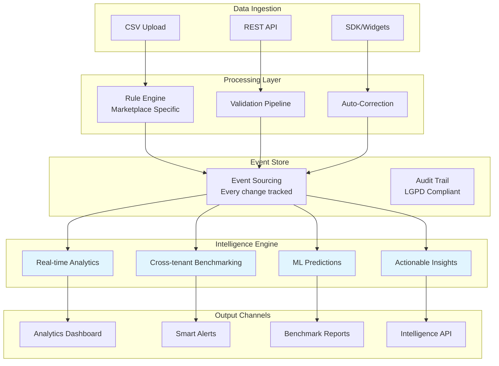
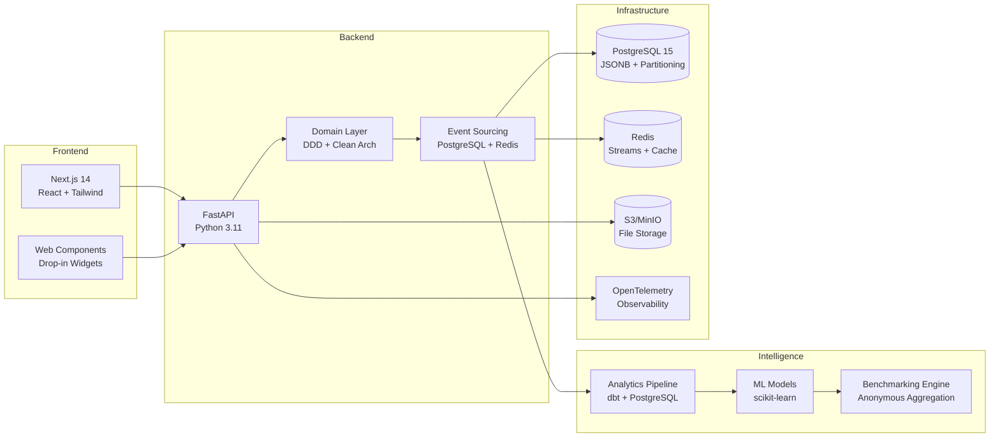
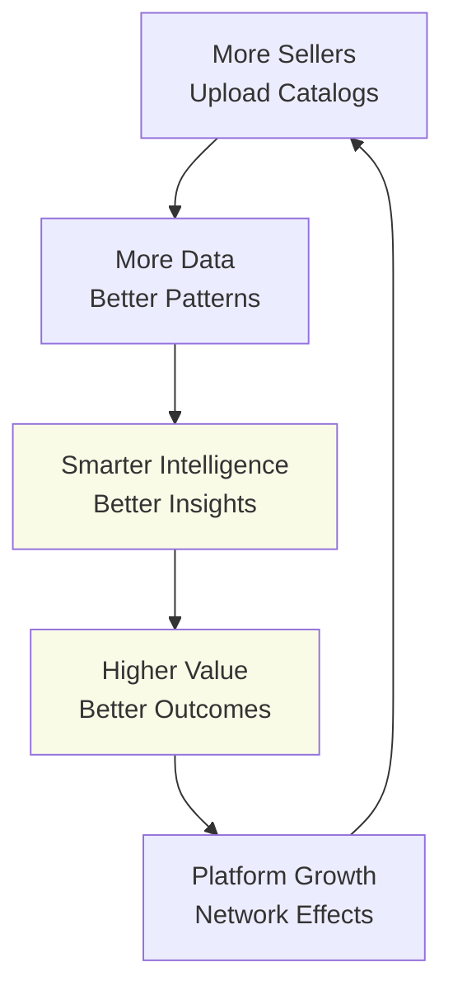
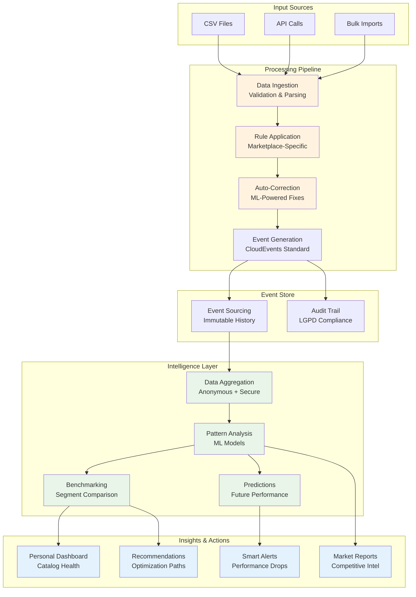

# ValidaHub 🚀

> **The Bloomberg of Brazilian Marketplaces**  
> Transform CSV validation into marketplace intelligence that drives better decisions and higher sales.

[](https://opensource.org/licenses/MIT)
[](docs/security/)
[](docs/architecture/)
[](docs/architecture/API.md)

---

## 🎯 Vision & Mission

**Mission**: Transform catalog errors into marketplace intelligence, helping sellers sell more and integrators operate with confidence.

**Vision**: Become Brazil's standard business intelligence for e-commerce in 3 years — the definitive platform where sellers, integrators, and marketplaces find competitive insights and predictions.

### Why ValidaHub Exists

- **Today**: Each seller suffers alone with different rules, repetitive errors, and lost sales
- **Tomorrow**: A central hub of validation + intelligence that auto-corrects, generates insights, and improves everyone's performance

---

## 🧠 Intelligence-First Architecture

ValidaHub isn't just another CSV validator. We're building the **intelligence layer** for Brazil's e-commerce ecosystem through event sourcing and network effects.



---

## 💡 Key Features

### 🔥 Core Validation Engine
- **Multi-marketplace support**: Mercado Livre, Magalu, Amazon Brasil
- **Real-time processing**: SSE streams + webhooks for instant feedback  
- **Smart corrections**: Auto-fix common catalog errors
- **Rule versioning**: Shadow mode testing before rule changes

### 📊 Intelligence Platform
- **Personal Analytics**: Track your catalog health over time
- **Anonymous Benchmarking**: Compare against market segments (LGPD-compliant)
- **Predictive Insights**: Forecast catalog issues before they happen
- **Competitive Intelligence**: Market trends and opportunity identification

### 🏗️ Developer Experience
- **15-minute integration**: From signup to first job
- **SDKs in 3 languages**: JavaScript, Python, Java
- **OpenAPI 3.1**: Contract-first development
- **Drop-in widgets**: `<vh-uploader>` component

---

## 🏛️ Technology Stack

### Core Architecture


### Key Technologies
- **Backend**: FastAPI + Pydantic + SQLAlchemy + Alembic
- **Frontend**: Next.js 14 (App Router) + shadcn/ui
- **Database**: PostgreSQL 15 with JSONB and partitioning
- **Queue**: Redis Streams → Kafka (future scale)
- **Storage**: S3/MinIO with presigned URLs
- **Observability**: OpenTelemetry + Prometheus + Sentry
- **Security**: JWT + scopes, CORS, rate limiting, LGPD compliance

---

## 🚀 Quick Start

### Prerequisites
- Docker & Docker Compose
- Node.js 18+ (for frontend)
- Python 3.11+ (for backend)

### 5-Minute Setup

```bash
# Clone the repository
git clone https://github.com/validahub/validahub-alpha.git
cd validahub-alpha

# Start infrastructure services
make up

# Run database migrations
make db.migrate

# Generate API types from OpenAPI
make contracts.gen

# Start development servers
make dev

# Your ValidaHub instance is ready!
# API: http://localhost:8000
# Web Dashboard: http://localhost:3000
```

### First Job Submission

```python
import requests

# Submit a CSV for validation
response = requests.post('http://localhost:8000/jobs', 
    headers={
        'Authorization': 'Bearer your-jwt-token',
        'X-Tenant-Id': 'your-tenant-id',
        'Idempotency-Key': 'unique-operation-id'
    },
    json={
        'channel': 'mercado_livre',
        'seller_id': 'seller_123',
        'file_ref': 's3://bucket/products.csv'
    }
)

job = response.json()
print(f"Job created: {job['id']}")

# Monitor progress via Server-Sent Events
import sseclient

events = sseclient.SSEClient('http://localhost:8000/jobs/stream')
for event in events:
    print(f"Status update: {event.data}")
```

---

## 📡 API Overview

### Intelligence-Focused Endpoints

```yaml
# Core Validation
POST   /jobs              # Submit validation job (idempotent)
GET    /jobs/{id}          # Job status + correction details
POST   /jobs/{id}/retry    # Reprocess with latest rules
GET    /jobs/stream        # Real-time updates via SSE

# Intelligence APIs  
GET    /analytics/personal          # Your catalog health metrics
GET    /benchmarks/segment/{segment} # Anonymous market comparison
GET    /insights/predictions        # ML-powered forecasts
GET    /intelligence/trends         # Market intelligence feeds

# Developer Tools
GET    /rules/profiles             # Available marketplace rule sets
POST   /rules/simulate             # Test rules before applying
GET    /health                     # System health + metrics
```

### Event-Driven Architecture

Every action generates CloudEvents for downstream intelligence:

```json
{
  "id": "550e8400-e29b-41d4-a716-446655440000",
  "specversion": "1.0",
  "source": "apps/api",
  "type": "job.succeeded",
  "time": "2025-08-29T15:30:00Z",
  "subject": "job:6c0e7b5a-4f3c-4d1e-9b8f-2a1c3d4e5f6g",
  "tenant_id": "tenant_123",
  "data": {
    "job_id": "6c0e7b5a-4f3c-4d1e-9b8f-2a1c3d4e5f6g",
    "counters": {"errors": 2, "warnings": 5, "total": 1200},
    "duration_ms": 3420,
    "corrections_applied": 15
  }
}
```

---

## 🌐 Network Effects & Intelligence

ValidaHub creates a **virtuous cycle** where more users generate better intelligence for everyone:



### How Network Effects Work

1. **Data Aggregation**: Each validation job contributes to collective intelligence
2. **Anonymous Benchmarking**: Compare your performance against market segments (LGPD-compliant)
3. **Pattern Recognition**: ML models improve with more diverse catalog data
4. **Market Insights**: Cross-marketplace trends become visible only at scale
5. **Competitive Moats**: First-mover advantage compounds over time

---

## 🔄 Data Flow & Intelligence Pipeline



---

## 🏗️ Contributing

We're building ValidaHub as an **open intelligence platform**. Contributions welcome!

### Development Setup

```bash
# Install development dependencies
pip install -r requirements-dev.txt
npm install

# Run tests
make test                # All tests
make test.unit          # Unit tests only
make test.integration   # Integration tests
make check.arch         # Architecture compliance

# Code quality
make lint               # Ruff + ESLint
make type-check         # mypy + tsc
make format             # Auto-format code
```

### Architecture Principles

- **Domain-Driven Design**: Pure domain logic, ports & adapters
- **Event Sourcing**: Every change is an event, full audit trail
- **Contract-First**: OpenAPI 3.1 as single source of truth
- **Test-Driven**: RED → GREEN → REFACTOR cycle
- **Telemetry-First**: Structured logging, metrics, traces

### Contribution Guidelines

1. **Fork & Branch**: Create feature branches from `main`
2. **Conventional Commits**: `feat(domain): add catalog validation`
3. **Tests Required**: Unit + integration tests for new features  
4. **Architecture Tests**: Verify layer separation compliance
5. **Documentation**: Update ADRs for architectural decisions

---

## 📊 Roadmap & Intelligence Evolution

### Phase 1: Foundation Intelligence (Q1 2025)
**Theme**: "Your Catalog Health Dashboard"

- ✅ Personal analytics tracking
- ✅ Error pattern analysis  
- ✅ Processing time trends
- ✅ Basic improvement suggestions

### Phase 2: Competitive Intelligence (Q2-Q3 2025)
**Theme**: "How You Compare to Market"

- 🚧 Anonymous benchmarking system
- 📋 Market trend identification
- 📋 Segment performance comparison
- 📋 Best practices recommendations

### Phase 3: Predictive Intelligence (Q4 2025+)
**Theme**: "Your Marketplace Oracle"

- 📋 Catalog health forecasting
- 📋 Error prevention predictions
- 📋 Market trend predictions
- 📋 Optimization roadmaps

---

## 🔒 Privacy & Legal

### LGPD Compliance

ValidaHub is **privacy-first** and fully compliant with Brazil's LGPD (Lei Geral de Proteção de Dados):

- **Anonymous Benchmarking**: No PII in comparative analytics
- **Data Minimization**: Only collect what's necessary for intelligence
- **Consent Management**: Clear opt-in/opt-out for data usage
- **Right to Deletion**: Complete data removal on request
- **Audit Trails**: Immutable logs of all data access
- **Security by Design**: Encryption at rest and in transit

### Security Features

- **Idempotency Keys**: Prevent duplicate operations
- **Rate Limiting**: Per-tenant quotas and throttling
- **JWT + Scopes**: Fine-grained access control  
- **CSV Security**: Formula injection prevention
- **Audit Logging**: Complete operation trail
- **Correlation IDs**: Request tracing across services

---

## 📞 Support & Community

### Getting Help

- **Documentation**: [docs/](docs/) - Comprehensive guides and ADRs
- **API Reference**: [OpenAPI Spec](docs/architecture/API.md)
- **GitHub Issues**: Bug reports and feature requests
- **Discussions**: Architecture and product discussions

### Enterprise Support

For enterprises requiring SLAs, custom integrations, or dedicated support:

- **Email**: enterprise@validahub.com
- **Calendar**: [Book a demo](https://calendar.validahub.com)
- **Slack**: Join our partner channel

---

## 📄 License

ValidaHub is released under the [MIT License](LICENSE).

**Copyright © 2025 ValidaHub**  
*Transforming Brazilian e-commerce, one catalog at a time.*

---

<div align="center">

**[🚀 Get Started](https://app.validahub.com)** • 
**[📖 Documentation](docs/)** • 
**[💬 Community](https://github.com/validahub/validahub-alpha/discussions)** •
**[🐛 Issues](https://github.com/validahub/validahub-alpha/issues)**

*Built with ❤️ in São Paulo, Brazil*

</div>