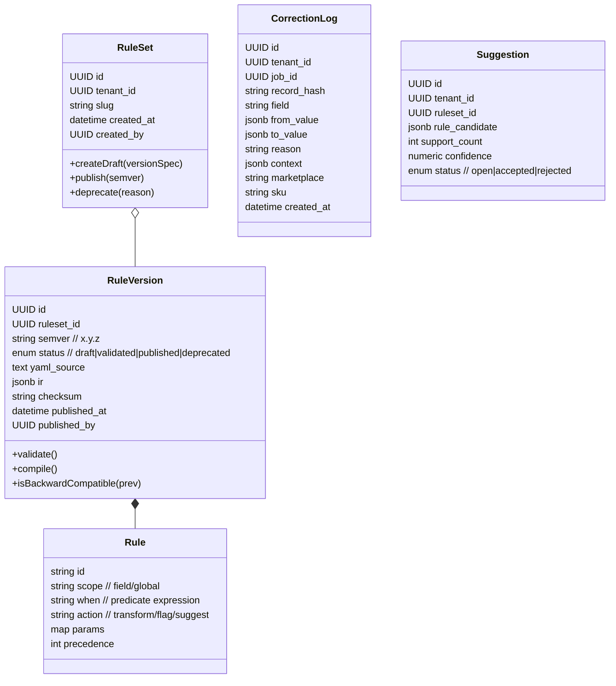
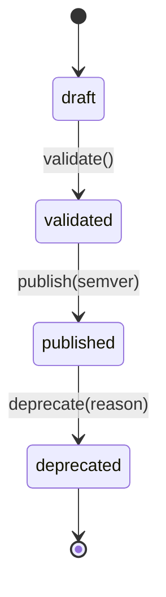

# Smart Rules Engine — Orchestrated Agent Prompts & Architecture (v1)

> ValidaHub • DDD + Clean Architecture • multi‑tenant • SemVer rule packs • retrocompat

---

## TL;DR / Ordem de Execução

1. **DDD Architect** → mapa de Bounded Contexts, agregados, eventos, ports, ciclo de vida & versão.
2. **Rule Engine Specialist** → especificação do YAML schema → IR → runtime (hot‑reload, precedência, CCM).
3. **Database Specialist** → schema Postgres (JSONB/GIN, partições, MVs, RLS), migrações.
4. **Backend Dev** → FastAPI (CRUD regras, publish, corrections log, suggestions, cache Redis, webhooks, rate‑limit).
5. **Telemetry Architect** → OTel + CloudEvents + Grafana/Prometheus + pipeline Kafka→ClickHouse.
6. **TDD Engineer** → testes (unit, integration, contract, golden, perf, mutation, chaos), gates CI.
7. **Frontend Dev** → Next.js 15 Monaco editor + RuleBuilder DnD + analytics + SSE + Playwright.

Cada etapa produz artefatos versionados, com commits convencionais e saídas salvas em `.vh/steps/`.

---

## Governança do Fluxo (Feedback Loops + HITL)

**Princípios**

* **Loopback consciente**: qualquer mudança feita por agentes "posteriores" pode exigir ajuste nos "anteriores". O processo deve suportar *backpropagation* com contexto (diff/CR) e regeneração determinística dos artefatos afetados.
* **HITL obrigatório**: cada etapa termina em um *commit manual* (ponto de controle). Só após **GO** humano a próxima etapa consome os artefatos.
* **Rastreabilidade** de ponta a ponta: todo artefato tem `checksum`, `specVersion` e origem (agent/run/hash). Um **manifesto** controla dependências.

**Checkpoints & Gates (por etapa)**

1. **DDD Architect → Gate `arch.sync`**
   * Verifica esquemas de eventos e ports gerados vs linter de nomenclatura.
   * Emite `digest` com `ports`, `events`, `BCs` e seus `sha256`.

2. **Rule Engine Specialist → Gate `engine.spec`**
   * Valida JSON Schema do YAML, consistência `IR.schema_version`, e *pseudocode smoke*.

3. **Database Specialist → Gate `db.migrate`**
   * Sobe migrações em banco efêmero, aplica índices/partições, roda `EXPLAIN` canônico.

4. **Backend Dev → Gate `api.contracts`**
   * Testes de integração + *contract tests* com schemas de evento do DDD; coverage ≥80%.

5. **Telemetry Architect → Gate `obs.readiness`**
   * Exporters sobem, métricas mínimas presentes, dashboards carregam sem erro.

6. **TDD Engineer → Gate `quality`**
   * Perf 50k<3s (mediana); mutation threshold; chaos básicos passam.

7. **Frontend Dev → Gate `ux.e2e`**
   * Playwright green para editor/publish/rollback/analytics.

**Manifesto de Artefatos (`.vh/manifest.yml`)**

```yaml
spec: 0.1.0
runs:
  - id: R2025-08-29-001
    agent: ddd-architect
    inputs_hash: 9f2c...
    artifacts:
      docs/rules/architecture.md: sha256:... 
      docs/rules/events.md: sha256:...
      docs/rules/ports.md: sha256:...
    digest:
      ports: [RuleRepository, RuleCompiler, SuggestionEngine, CachePort, EventBusPort]
      events:
        - type: rules.rule.published.v1
          schema_hash: 1f0a...
      contracts_hash: 4f3b...
    depends_on: []
  - id: R2025-08-29-004
    agent: backend-dev
    depends_on: [ddd-architect, rule-engine-specialist, database-specialist]
    artifacts:
      apps/api/main.py: sha256:...
      tests/integration/test_rules_api.py: sha256:...
```

---

## PROMPTS ORQUESTRADOS (para `./scripts/claude/c.sh`)

> Execute cada bloco e salve a saída em `.vh/steps/NN-<agent>.md`. Em seguida, aplique o commit sugerido.

### 01 — DDD Architect Agent

**Comando**

```bash
./scripts/claude/c.sh "ddd-architect" <<'PROMPT' > .vh/steps/01-ddd-architect.md
Você é o **DDD Architect** do ValidaHub. Objetivo: consolidar a arquitetura do Smart Rules Engine conforme abaixo e gerar artefatos (diagramas Mermaid, invariantes, eventos, ports) prontos para PR.

Contexto essencial:
- Bounded Contexts: Rules, Corrections, Suggestions, Jobs (existente) com ACL.
- Agregados: RuleSet (AR), RuleVersion (entity), Rule (VO), CorrectionLog (AR), Suggestion (AR).
- Ciclo de vida: draft→validated→published→deprecated. Imutável após publish.
- SemVer e retrocompat; multi‑tenant.

Tarefas:
1) Refinar diagramas (BC map, class diagram, state machine) com nomenclatura final.
2) Definir payloads de **Domain** e **Integration** events (CloudEvents), incluindo `type`, `subject`, `schemaVersion`.
3) Especificar **ports** como Protocols Python (assinaturas definitivas) mantendo domínio puro.
4) Regras de versionamento & rollback, chaves de cache, políticas de compatibilidade.

Entregáveis:
- `docs/rules/architecture.md` (conteúdo completo).
- `docs/rules/events.md` (esquemas JSON).
- `docs/rules/ports.md` (interfaces Python).

Saída esperada: Markdown único contendo **TODOS** os arquivos (com separadores ```---file:PATH```).
PROMPT
```

**Commit sugerido**

```bash
git add docs/rules && git commit -m "feat(rules-arch): BCs, agregados, eventos e ports do Smart Rules Engine"
```

---

### 02 — Rule Engine Specialist Agent

```bash
./scripts/claude/c.sh "rule-engine-specialist" <<'PROMPT' > .vh/steps/02-rule-engine.md
Você é o **Rule Engine Specialist**. Gere a especificação técnica do **YAML Schema → IR → Runtime**.

Incluir:
- Definição formal do YAML (JSON Schema), tipagem de ações (`assert`, `transform`, `suggest`), `precedence`, `scope`.
- IR estável com `schema_version`, `checksum`, normalização de expressões.
- Algoritmos: ordenação por precedência, short‑circuit por campo, vetorização por lote.
- **Hot‑reload** com invalidação por checksum; chaves de cache.
- **CCM** (Canonical CSV Model) com mapeamento por marketplace (ex.: Meli, Amazon, Magalu).
- Regras de compatibilidade SemVer (major/minor/patch) e migração IR.
- Benchmarks e harness para medir `50k linhas < 3s` (3 execuções, mediana) + relatório.
- Golden tests por marketplace (estrutura de diretórios e exemplos).

Entregáveis (em um único Markdown com separadores de arquivo):
- `docs/rules/yaml-schema.json`
- `docs/rules/ir-spec.md`
- `rules/engine/runtime.md` (pseudocódigo)
- `rules/tests/golden/README.md`
PROMPT
```

**Commit**

```bash
git add docs/rules rules/tests && git commit -m "feat(rules-engine): schema YAML, IR spec, runtime e golden tests scaffolding"
```

---

### 03 — Database Specialist Agent

```bash
./scripts/claude/c.sh "database-specialist" <<'PROMPT' > .vh/steps/03-database.md
Você é o **Database Specialist**. Projete schema Postgres para **regras** e **correções** com performance e multi‑tenant.

Incluir:
- Tabelas `rule_sets`, `rule_versions`, `correction_logs`, `suggestions`, `rule_effectiveness`.
- Particionamento de `correction_logs` por data; índices GIN/GiST em JSONB; RLS por `tenant_id`.
- Views materializadas para frequências/ padrões; procedures para top‑k por campo.
- Estratégia de retenção/arquivamento (+ scripts VACUUM/ANALYZE) e backups.
- Plano de migração via Alembic sem downtime.

Entregáveis (um markdown com múltiplos arquivos):
- `db/migrations/*` (scripts SQL completos)
- `docs/db/performance.md`
- `docs/db/retention.md`
PROMPT
```

**Commit**

```bash
git add db/migrations docs/db && git commit -m "feat(db): schema regras+correções, partições JSONB, MVs e retenção"
```

---

### 04 — Backend Dev Agent

```bash
./scripts/claude/c.sh "backend-dev" <<'PROMPT' > .vh/steps/04-backend.md
Você é o **Backend Dev** (FastAPI). Implemente endpoints, casos de uso e adapters.

Contexto:
- Ports definidos (RuleRepository, RuleCompiler, SuggestionEngine, CachePort, EventBusPort).
- Redis para cache IR; SQLAlchemy + Alembic no Postgres; rate‑limit por tenant.

Tarefas:
- Use cases: `CreateRule`, `PublishRule`, `LogCorrection`, `GetSuggestions`.
- Endpoints: `POST/GET/PUT /rules`, `POST /corrections/log`, `GET /suggestions`.
- Idempotência por header `Idempotency-Key`; validação antes de publish; webhooks de mudança.
- Integração Jobs: adapter para aplicar IR no pipeline.
- Testes de integração com coverage > 80%.

Entregáveis (markdown com multi‑arquivos):
- `apps/api/main.py`, `apps/api/routers/rules.py`, `apps/api/schemas/*.py`
- `apps/core/usecases/*.py`, `apps/core/ports/*.py`
- `apps/adapters/repository/*.py`, `apps/adapters/cache/redis.py`, `apps/adapters/events/kafka.py`
- `tests/integration/test_rules_api.py`
PROMPT
```

**Commit**

```bash
git add apps tests && git commit -m "feat(api): CRUD de regras, publish, corrections log e suggestions com cache Redis"
```

---

### 05 — Telemetry Architect Agent

```bash
./scripts/claude/c.sh "telemetry-architect" <<'PROMPT' > .vh/steps/05-telemetry.md
Você é o **Telemetry Architect**. Instrumente o engine: métricas, logs estruturados, tracing e pipeline de eventos.

Incluir:
- OpenTelemetry (traces/spans e métricas), labels `{tenant, ruleset, semver, job_id}`.
- CloudEvents schemas; export Prometheus; dashboards Grafana; alertas (F1<0.5, P95>800ms, cache hit<0.9).
- Pipeline Kafka→ClickHouse para análise offline (DDL e consumidores).

Entregáveis:
- `docs/telemetry/events.md`, `ops/grafana/dashboards/*.json`, `ops/prometheus/alerts.yml`
- `pipelines/clickhouse/ddl.sql`, `pipelines/kafka/consumers/rules_effectiveness.py`
PROMPT
```

**Commit**

```bash
git add docs/telemetry ops/ pipelines && git commit -m "feat(obs): OTel+CloudEvents, Grafana/Prometheus, Kafka→ClickHouse"
```

---

### 06 — TDD Engineer Agent

```bash
./scripts/claude/c.sh "tdd-engineer" <<'PROMPT' > .vh/steps/06-testing.md
Você é o **TDD Engineer**. Configure a estratégia de testes e gates de qualidade.

Incluir:
- Unit (parser, compiler, executor), Integration (API+DB+Redis), Contract (CloudEvents), Golden por marketplace.
- Performance benchmark (50k linhas, 3 execuções, mediana) com gate CI.
- Mutation (mutmut) e Chaos (falhas cache/Kafka/rede) com cenários.
- CI pipeline (GitHub Actions) com coverage > 90% e gates.

Entregáveis:
- `tests/unit/*`, `tests/golden/*`, `tests/perf/benchmark_50k.py`, `tests/mutation/*`
- `.github/workflows/ci.yml`
PROMPT
```

**Commit**

```bash
git add tests .github/workflows && git commit -m "test(rules): suite completa + perf/mutation/contract e gates CI"
```

---

### 07 — Frontend Dev Agent

```bash
./scripts/claude/c.sh "frontend-dev" <<'PROMPT' > .vh/steps/07-frontend.md
Você é o **Frontend Dev**. Construa o editor visual de regras e analytics.

Incluir:
- Next.js 15 + Monaco (YAML), validação instantânea (SSE para erros), preview em tempo real.
- RuleBuilder drag‑and‑drop (shadcn/ui), templates por marketplace, histórico de versões com diff visual.
- Dashboard /rules/analytics (Chart.js) + SSE para métricas.
- Notificações para sugestões automáticas e ação de aplicar/ignorar.
- Playwright E2E cobrindo editor, publish e rollback.

Entregáveis:
- `apps/web/app/rules/editor/page.tsx` (Monaco configurado)
- `apps/web/components/RuleBuilder.tsx`
- `apps/web/app/rules/analytics/page.tsx`
- `apps/web/tests/e2e/*.spec.ts`
PROMPT
```

**Commit**

```bash
git add apps/web && git commit -m "feat(web): editor YAML com Monaco, RuleBuilder DnD e analytics com SSE"
```

---

## Bounded Contexts & ACL

```mermaid
flowchart LR
  subgraph Rules[Rules BC]
    RuleSet-->RuleVersion
    RuleVersion-->Rule[Value Objects]
    Rules-->|DomainEvents|RulesEvents[RuleCreated/Published/Deprecated]
    Corrections[Corrections BC]-->Suggestions[Suggestions BC]
  end

  subgraph Jobs[Jobs BC]
    JobAggregate-->ValidationPipeline
  end

  Rules<-->ACL[Anti-Corruption Layer]
  ACL<-->Jobs

  Rules-->|Integration Events (CloudEvents)|EventBus[(Kafka)]
  Jobs-->|JobValidated/RuleApplied|EventBus
```

**ACL**: traduz *RuleApplied*↔*Job* sem vazar linguagem do Jobs BC (IDs, estados, CCM).

---

## Agregados, VOs e Relacionamentos



---

## Ciclo de Vida da Regra (RuleVersion)



**Invariantes**

* `published` é *imutável* (apenas deprecável).
* Compilação gera `ir` determinístico (`checksum` do YAML + schema versão).
* SemVer: `MAJOR` quebra, `MINOR` adiciona/afrouxa validações, `PATCH` bugfix/otimização sem mudança semântica.

---

## Eventos de Domínio & Integração

**Domínio (Rules BC)**

* `RuleCreated(ruleset_id, version_id, tenant_id, created_by)`
* `RuleValidated(version_id, report)`
* `RulePublished(ruleset_id, semver, checksum)`
* `RuleDeprecated(version_id, reason)`
* `CorrectionLogged(correction_id, job_id, marketplace, field)`
* `SuggestionMaterialized(suggestion_id, ruleset_id)`

**Integração (CloudEvents)**

* `rules.rule.published.v1`
  Data: `{tenant_id, ruleset_id, semver, checksum, published_at}`
* `rules.correction.logged.v1`
  Data: `{tenant_id, job_id, record_hash, field, from, to, reason, marketplace, sku, ts}`
* `rules.rule.applied.v1`
  Data: `{tenant_id, job_id, ruleset_id, semver, rule_id, record_count, latency_ms}`

> Atributos CloudEvents: `id`, `source`, `specversion`, `type`, `subject`, `time`, `datacontenttype`.

---

## Ports (Domínio puro / Python Protocols)

```python
class RuleRepository(Protocol):
    def get_ruleset(self, tenant_id: UUID, slug: str, semver: str|None) -> RuleSet: ...
    def save_draft(self, ruleset: RuleSet, version: RuleVersion) -> None: ...
    def publish(self, ruleset_id: UUID, version_id: UUID, semver: str) -> None: ...

class RuleCompiler(Protocol):
    def validate(self, yaml_source: str) -> ValidationReport: ...
    def compile(self, yaml_source: str) -> IR: ...

class SuggestionEngine(Protocol):
    def mine(self, tenant_id: UUID, window: Interval) -> list[RuleCandidate]: ...

class CachePort(Protocol):
    def get_ir(self, key: str) -> IR|None: ...
    def set_ir(self, key: str, ir: IR, ttl_s: int) -> None: ...

class EventBusPort(Protocol):
    def publish(self, event_type: str, data: dict) -> None: ...
```

---

## Estratégia de Versionamento & Migração

* Chaves: `rules:ir:{tenant}:{slug}:{semver}:{checksum}` → **cache**.
* Publicação é transacional: valida → compila → grava versão → emite `rule.published` → invalida cache antigo.
* *Rollback*: apontar consumidor para semver anterior (config de *active version* por tenant/slug), mantendo artefatos imutáveis.
* Migrações de schema (YAML → IR) com `schema_version` embutida no `ir`.

---

## Contratos de Backend (FastAPI)

**Endpoints**

* `POST /rules` (idempotente por `Idempotency-Key`) → cria/atualiza *draft* (`slug`, `yaml`, metadados)
* `GET /rules?tenant&slug&status` → paginação, filtro
* `PUT /rules/{ruleset_id}/publish` → body `{semver}`
* `POST /corrections/log` → log estruturado (ver tabela)
* `GET /suggestions?tenant&ruleset` → top frequências/ candidatos

**Validação & Rate limiting**

* `POST /rules` (10/min por tenant), `publish` (3/min por tenant)
* Webhook `POST /webhooks/rules` para terceiros ao publicar/depredar

**Integração com Jobs**

* Aplicação de regras via *adapter* no pipeline: resolve `active semver`, puxa IR do cache (Redis) ou repositório, executa.

---

## YAML → IR → Runtime

**YAML (exemplo)**

```yaml
schema: 1
rules:
  - id: title.trim
    scope: field:title
    when: "len(value)>0"
    action: trim
    precedence: 10
  - id: price.positive
    scope: field:price
    when: "value is not None"
    action: assert
    params: { op: gt, than: 0 }
    precedence: 20
```

**IR (conceito)**

```json
{
  "schema":1,
  "rules":[
    {"id":"title.trim","scope":"field:title","pred":"len(v)>0","op":"trim","prec":10},
    {"id":"price.positive","scope":"field:price","pred":"v is not None","op":"assert","args":{"op":"gt","than":0},"prec":20}
  ]
}
```

**Runtime**

* Precedência crescente; *short‑circuit* por campo.
* Hot‑reload: invalida cache por `checksum`.
* **CCM**: mapeia CSV→modelo canônico (campos: `sku`, `title`, `price`, `brand`, etc.) antes da execução.
* Otimizações: *predicate pushdown*, *constant folding*, *vectorization* (pandas/pyarrow), *batching* (10k linhas/chunk). Meta: **50k linhas < 3s**.

---

## Postgres (JSONB + Particionamento)

**Tabelas principais** (simplificado)

```sql
create table rule_sets(
  id uuid primary key,
  tenant_id uuid not null,
  slug text not null,
  created_at timestamptz not null default now(),
  created_by uuid not null,
  unique(tenant_id, slug)
);

create table rule_versions(
  id uuid primary key,
  ruleset_id uuid not null references rule_sets(id),
  semver text not null,
  status text not null check (status in ('draft','validated','published','deprecated')),
  yaml_source text not null,
  ir jsonb,
  checksum text not null,
  schema_version int not null,
  published_at timestamptz,
  published_by uuid,
  unique(ruleset_id, semver)
);

create table correction_logs(
  id uuid primary key,
  tenant_id uuid not null,
  job_id uuid not null,
  record_hash text,
  field text,
  from_value jsonb,
  to_value jsonb,
  reason text,
  context jsonb,
  marketplace text,
  sku text,
  created_at timestamptz not null default now()
) partition by range (created_at);
```

**Índices**

```sql
create index on correction_logs using gin (context jsonb_path_ops);
create index on correction_logs (tenant_id, created_at);
create index on correction_logs (tenant_id, field);
```

**Views & MVs**

* `mv_correction_freq(tenant_id, ruleset_id, field, pattern, support_count)` (refresh incremental)
* RLS por `tenant_id`.

---

## Telemetria & SLOs

* **Métricas**: `rules_compile_ms`, `rules_ir_cache_hit_ratio`, `rule_apply_latency_ms{rule_id}`, `throughput_rows_per_s`, `suggestion_latency_ms`, `P50/P95/P99`.
* **Tracing**: spans `compile→load_ir→apply_rules→emit_events` com baggage `{tenant, ruleset, semver, job_id}`.
* **Dashboards**: efetividade: `precision/recall/F1` por regra & janela.
* **Alertas**: F1 < 0.5 (24h), `ir_cache_hit_ratio<0.9`, `P95>800ms`.

---

## Estratégia de Testes (TDD/CI)

* Unit (parser/validator/compiler/executor). Hypothesis p/ invariantes.
* Integration (pipeline de job aplicando IR real).
* Contract (Rules↔Jobs via ACL, CloudEvents schemas).
* Golden tests por marketplace (fixtures CSV + expected CCM + transforms).
* Performance (50k linhas, 3 execuções medianas; gate no CI).
* Mutation (mutmut) com limiar > 70% survived→FAIL.
* Chaos (cache miss, falha Kafka, rede lenta) com tolerância definida.

---

## c.sh — Especificação de Robustez

**Objetivo**: padronizar chamadas a LLMs (Claude/GPT), injetar *system prompts*, anexar contexto (manifest/digests/ADRs), persistir saídas, particionar arquivos, garantir idempotência e observabilidade.

**Requisitos**

* Entrada via STDIN (heredoc) + flags: `--agent`, `--model`, `--temp`, `--seed`, `--ctx`, `--force`, `--out`.
* Injeta `system` a partir de `.claude/agents/<agent>.md` + *context pack* (`.vh/manifest.yml`, últimos `digests`, ADRs relevantes).
* **Idempotência**: chave `run_key = sha256(agent + system + input + ctx)`; se existir em `.vh/runs/<run_key>`, retorna cache (a menos de `--force`).
* **File‑split** por marcadores `---file:PATH` ; valida se cada arquivo tem conteúdo e cria diretórios.
* Persistência: salva *prompt*, *raw output*, *arquivos splitados*, *metadata.json* (model, tokens, costs, timings, hashes).
* Observabilidade: log estruturado em `.vh/runs/<run_key>/meta.json` + métrica Prometheus local (`vh_csh_run_seconds`).
* Fail‑fast com:
  * `EX_DATAERR` quando a saída não contém nenhum `---file:` apesar de solicitado.
  * `EX_CONFIG` quando `agent` inexiste.
  * `EX_TEMPFAIL` em rate limit/transientes com backoff exponencial e retry.

**Skeleton** (`scripts/claude/c.sh`)

```bash
#!/usr/bin/env bash
set -euo pipefail
AGENT="$1"; shift || true
OUT_DIR=".vh/steps"; mkdir -p "$OUT_DIR" "${RUN_DIR:-.vh/runs}"
SYS=".claude/agents/${AGENT}.md"; [[ -f "$SYS" ]] || { echo "agent not found"; exit 78; }
INPUT_FILE=$(mktemp); cat > "$INPUT_FILE"
CTX_FILE="${CTX_FILE:-.vh/context-pack.json}"
RUN_KEY=$(printf "%s" "$AGENT"; cat "$SYS" "$INPUT_FILE" "$CTX_FILE" 2>/dev/null || true | shasum -a 256 | cut -d' ' -f1)
RUN_DIR=".vh/runs/$RUN_KEY"; mkdir -p "$RUN_DIR"
python3 scripts/claude/run.py --agent "$AGENT" --sys "$SYS" --input "$INPUT_FILE" --ctx "$CTX_FILE" --out "$RUN_DIR/out.md"
python3 scripts/claude/split_files.py "$RUN_DIR/out.md" "$RUN_DIR/files"
cp "$RUN_DIR/out.md" "$OUT_DIR/$(date +%y%m%d)-$AGENT.md"
```

---

## HITL Checklist & Operacionalização

**Checklist por etapa (antes do GO humano)**

* **DDD Architect**: `arch.sync` passou; eventos/ports com `schema_hash`; ADR criada; diffs revisados.
* **Rule Engine**: JSON Schema válido; IR compila; benchmarks mínimos executados; golden fixtures inicializados.
* **Database**: migrações aplicam limpas em banco efêmero; índices/partições ok; planos `EXPLAIN` sem seq scan proibidos.
* **Backend**: integração + contracts verdes; rate‑limit e idempotência exercitados; webhooks simulados.
* **Telemetry**: OTel exporter pinga; métricas base expostas; dashboards abrem; alertas carregam.
* **TDD**: perf 50k<3s (mediana) registrado; mutation threshold atingido; cenários de chaos ok.
* **Frontend**: editor valida YAML; diff de versões renderiza; E2E publish/rollback/analytics.

### Template de CR (loopback)

Crie em **`.github/ISSUE_TEMPLATE/vh-cr.md`**:

```md
---
name: ValidaHub Change Request
about: Solicitar loopback entre agentes
labels: loopback-required
---
## Contexto
Agente solicitante: <!-- ex.: backend-dev -->
Motivação: <!-- síntese do problema -->

## DELTA
Impacto: [ports|events|ir|db|api|ui]
Diff (pseudo):
```
* type: rules.rule.published.v1 -> v2
* payload: add field `breaking:boolean`
```

Critérios de aceitação:
- [ ] Contracts atualizados
- [ ] Gates dependentes verdes
- [ ] ADR revisada
```

### Makefile — Gates & Utilitários

```make
.PHONY: gate.arch gate.engine gate.db gate.api gate.obs gate.quality gate.ux cr newrun

cr:
    gh issue create --template vh-cr.md || true

gate.arch: ; python3 scripts/gates/arch_digest_check.py .vh/manifest.yml docs/rules/events.md docs/rules/ports.md

gate.engine: ; jq -e . docs/rules/yaml-schema.json && python3 scripts/gates/ir_schema_check.py

gate.db: ; docker compose exec -T db psql -v ON_ERROR_STOP=1 -f db/diag/smoke.sql

gate.api: ; pytest -q tests/integration --cov=apps/api --cov-fail-under=80 && pytest -q tests/contracts

gate.obs: ; python3 scripts/gates/otel_smoke.py

gate.quality: ; pytest -q tests/perf/benchmark_50k.py && mutmut run --CI

gate.ux: ; pnpm -C apps/web test:e2e
```

### Context Pack (`.vh/context-pack.json`)

```json
{
  "manifest": ".vh/manifest.yml",
  "recentRuns": 5,
  "adrs": ["docs/adr/"],
  "digests": [".vh/digests/latest.json"],
  "env": {"service": "validahub", "env": "dev"}
}
```

---

## KPIs & SLOs (para *Definition of Done*)

* **Tech**: compile<100ms; 50k<3s; uptime 99.9%; suggestions P95<500ms.
* **Biz**: adoção de sugestões>60%; −40% correções manuais em 30d; >5 regras custom por cliente; criação<10min.
* **Qualidade**: coverage>85% (meta 90%); bugs prod<2/sprint; MTTR<30min; rollback<5%.

---

## Próximos passos

1. Rodar *01→07* nesta ordem.
2. Abrir PRs por etapa com links a `.vh/steps/*`.
3. Revisar ACL com o pipeline de Jobs e ligar o **CCM** nos conectores existentes.
4. HITL checkpoint após cada etapa com GO/NO-GO decision.
5. Monitorar gates e métricas de qualidade continuamente.