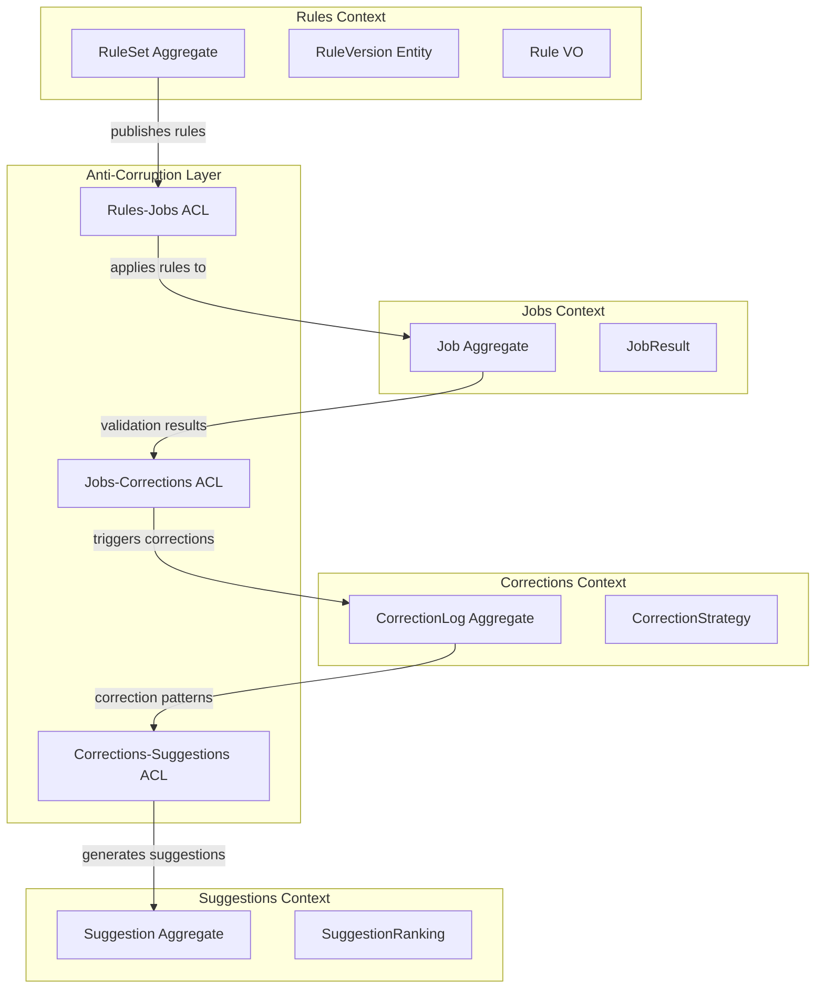
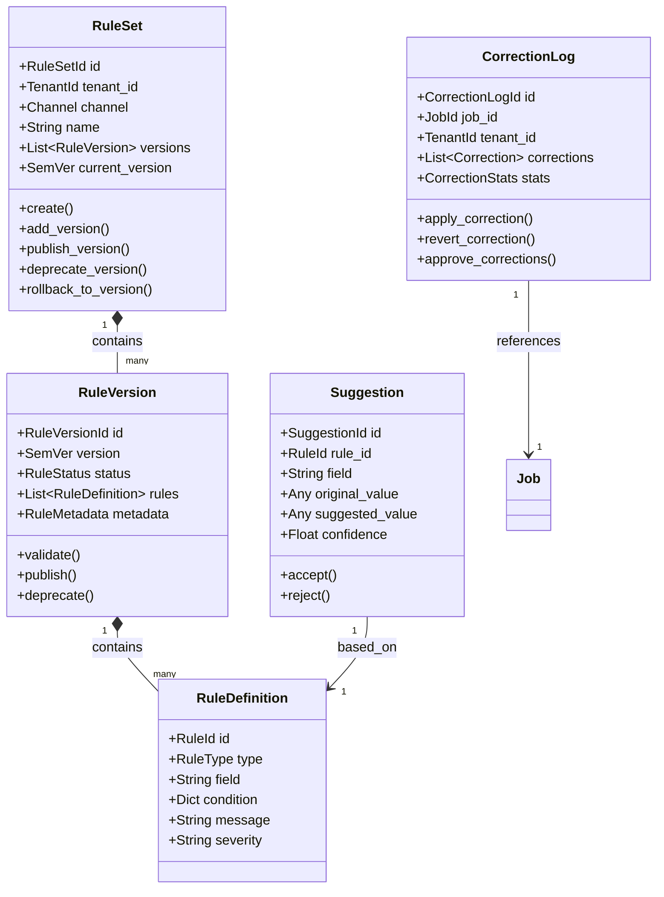
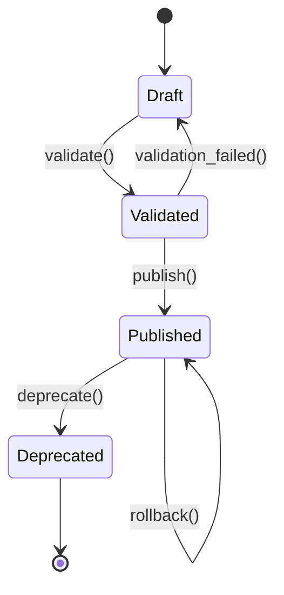
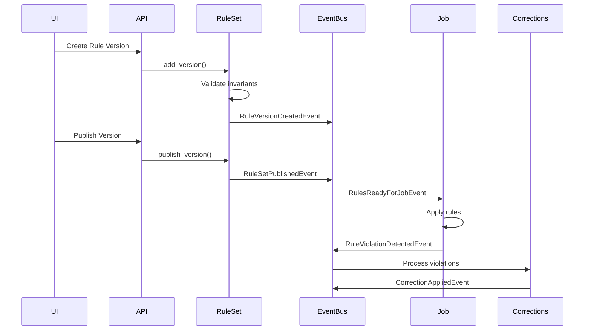

# Smart Rules Engine Architecture

## Executive Summary

O Smart Rules Engine é o sistema de validação e correção inteligente do ValidaHub, projetado para processar arquivos CSV de marketplaces com alta performance e flexibilidade. Seguindo princípios de Domain-Driven Design (DDD) e Clean Architecture, o sistema mantém separação clara entre domínio, aplicação e infraestrutura.

## Bounded Contexts e ACL



## Domain Model



## State Machines

### RuleSet Lifecycle



### State Transition Table

| Current State | Action | Next State | Conditions |
|--------------|--------|------------|------------|
| Draft | validate() | Validated | All rules pass validation |
| Draft | validate() | Draft | Validation errors found |
| Validated | publish() | Published | Checksum generated, version locked |
| Published | deprecate() | Deprecated | Not current version |
| Published | rollback() | Published | Previous version restored |

## Event Flow



## Invariants and Business Rules

### RuleSet Invariants
- **Unique Versions**: Each version within a RuleSet must be unique
- **Sequential Versioning**: New versions must be higher than existing ones
- **Immutable Published**: Published versions cannot be modified
- **Current Version Validity**: Current version must exist in versions list
- **Deprecation Constraint**: Cannot deprecate current version

### RuleVersion Invariants
- **Non-empty Rules**: Version must contain at least one rule
- **Unique Rule IDs**: No duplicate rule IDs within a version
- **Status Consistency**: Validated rules have no errors, published rules have checksum
- **Lifecycle Progression**: Draft → Validated → Published → Deprecated

### Compatibility Rules
- **Major Changes**: Removed rules or changed rule types
- **Minor Changes**: New rules added (backward compatible)
- **Patch Changes**: Rule conditions or messages modified
- **Auto-apply Policy**: Patches applied automatically if enabled
- **Shadow Period**: Minor versions tested for configured days
- **Major Opt-in**: Breaking changes require explicit approval

## Caching Strategy

### Cache Keys Structure
```
rules:set:{tenant_id}:{channel}:{rule_set_id}          # RuleSet aggregate
rules:version:{tenant_id}:{version_id}                 # Individual version
rules:current:{tenant_id}:{channel}                    # Current version pointer
rules:compiled:{tenant_id}:{channel}:{version}:{hash}  # Compiled rules
```

### TTL Policies
- **Published Versions**: 24 hours (immutable, safe to cache)
- **Draft Versions**: 5 minutes (frequently changing)
- **Compiled Rules**: 1 hour (expensive to compute)
- **Current Version Pointer**: 10 minutes (may change on rollback)

## Performance Optimizations

### Rule Compilation
- Rules are compiled to optimized evaluation trees on first use
- Compiled rules are cached with content-based hash keys
- Parallel evaluation for independent rules
- Short-circuit evaluation for composite rules

### Batch Processing
- Rules applied in batches of 1000 rows
- Streaming processing for large files (>50k rows)
- Async violation collection with buffering
- Result aggregation in memory with periodic flush

## Security Considerations

### Multi-tenancy Isolation
- All queries include tenant_id filter
- Cross-tenant rule sharing via marketplace templates only
- Tenant-specific encryption keys for sensitive rules

### Audit Trail
- All rule modifications logged with actor and timestamp
- Version history preserved even after deprecation
- Rule evaluation results archived for compliance
- Rollback operations require reason and approval

## Integration Points

### With Jobs Context
- **Event**: `RulesReadyForJobEvent` - Rules published and ready
- **Event**: `RuleSetAppliedEvent` - Rules applied to job
- **Port**: `RuleEvaluator` - Evaluate rules against job data

### With Corrections Context
- **Event**: `RuleViolationDetectedEvent` - Violation found
- **Port**: `CorrectionStrategy` - Determine correction approach
- **Port**: `CorrectionApplier` - Apply corrections to data

### With Suggestions Context
- **Event**: `CorrectionPatternDetectedEvent` - Pattern identified
- **Port**: `SuggestionGenerator` - Generate ML-based suggestions
- **Port**: `SuggestionRanker` - Rank suggestions by confidence

## Migration Strategy

### Version Migration Path
1. **Detection**: System detects tenant on old version
2. **Compatibility Check**: Evaluate upgrade compatibility
3. **Shadow Mode**: Run new version in parallel (if minor)
4. **Gradual Rollout**: Percentage-based migration
5. **Monitoring**: Track error rates and rollback if needed
6. **Completion**: Mark old version as deprecated

### Rollback Procedure
1. **Trigger**: Error rate exceeds threshold or manual intervention
2. **Immediate Switch**: Revert to previous stable version
3. **Event Publication**: Notify dependent systems
4. **Investigation**: Analyze failure and fix issues
5. **Retry**: Attempt migration with fixes